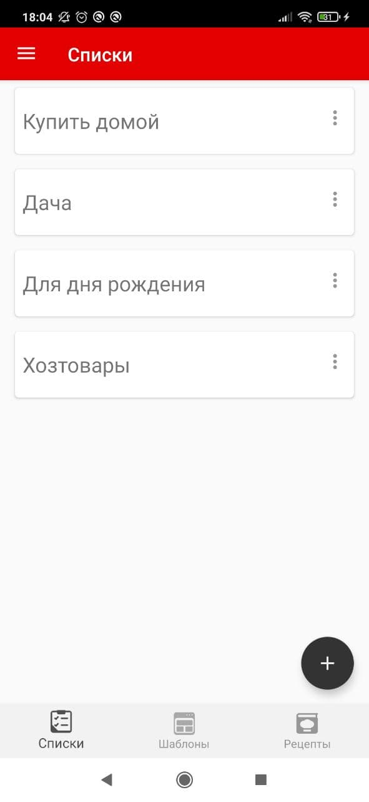
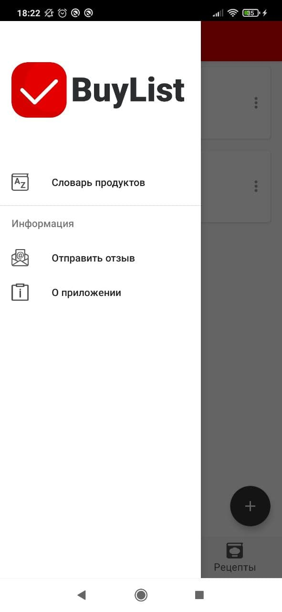
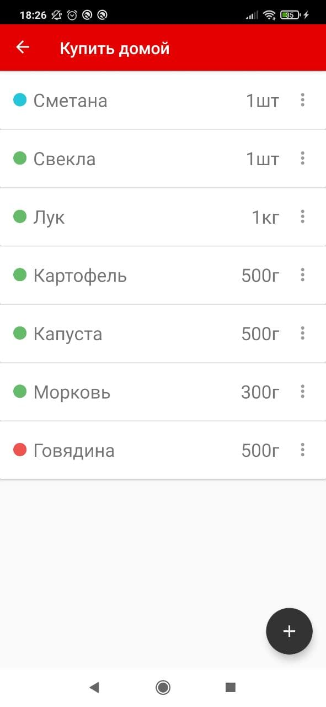
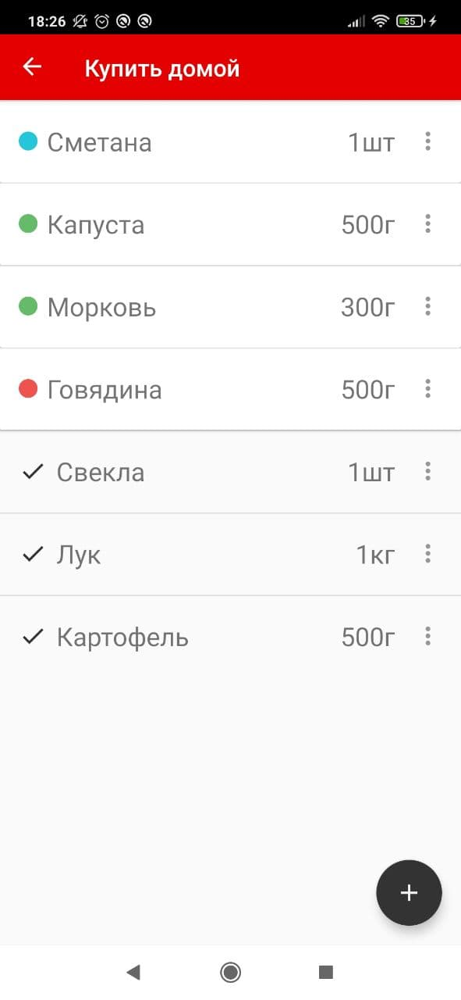
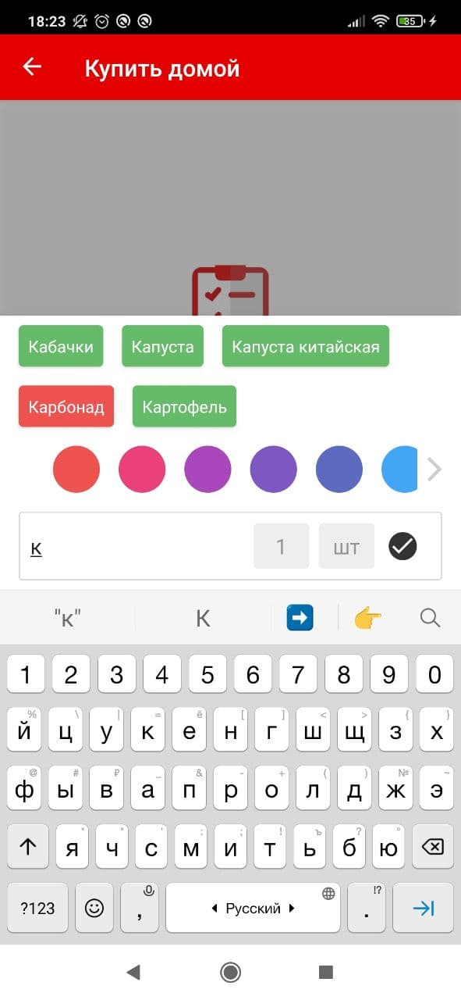
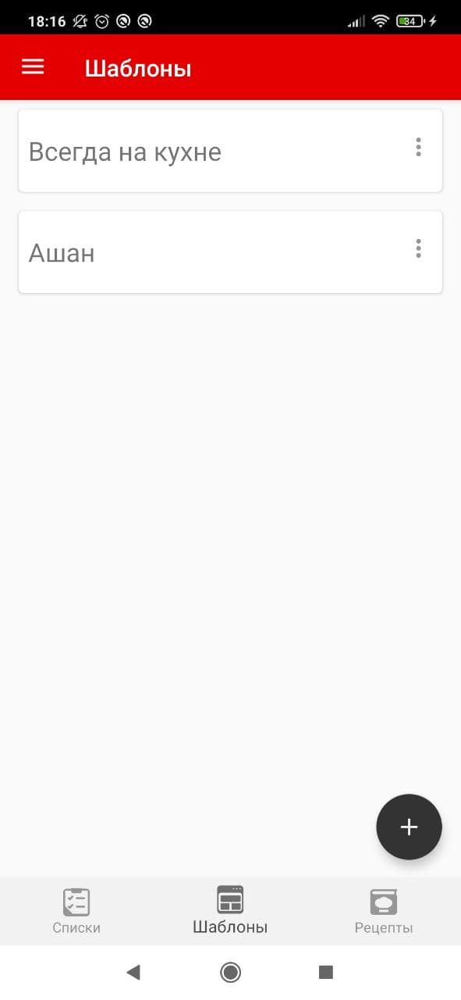
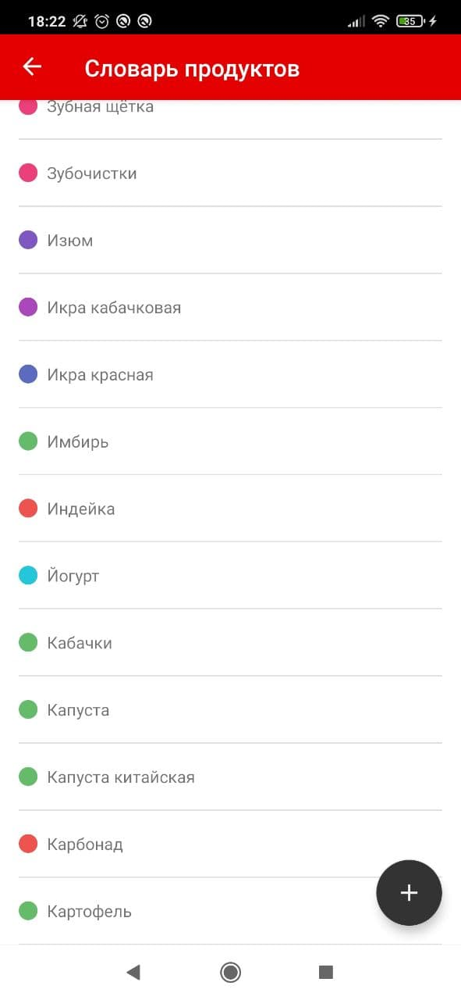
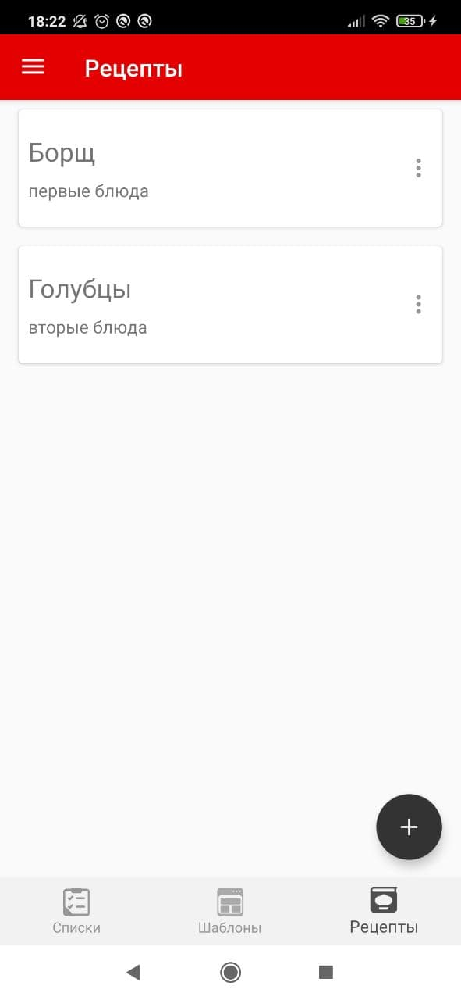

# BuyList

BuyList is a free [Android](https://en.wikipedia.org/wiki/Android_(operating_system)) application that will help you create a shopping list.


## Features

- Making shopping lists.  
- Patterns. They allow you to group products, for example, by purchase frequency or by favorite 
stores. Products from the pattern can be transferred to the shopping list in a couple of clicks, 
which will save your time.
- Recipes. The ability to create and store your favorite recipes, and transfer the ingredients to the shopping list.
- Dictionary of products. It is used to display "word tips" when entering an item. 
The main product names are already included in it, but if this is not enough, you can supplement it yourself.
- The number of lists, patterns and recipes is not limited.
- The added products are automatically grouped by the selected color category.


## Demo

<p align="center">
  
  
</p>

<p align="center">
  
  
  
</p>

<p align="center">
  
  
</p>

<p align="center">
  
  
</p>


## Project characteristics

- Tech-stack
  - [Kotlin](https://kotlinlang.org/) + [Coroutines](https://kotlinlang.org/docs/reference/coroutines-overview.html)
  - [Android Jetpack](https://developer.android.com/jetpack)
    - [Navigation](https://developer.android.com/topic/libraries/architecture/navigation/)
    - [LiveData](https://developer.android.com/topic/libraries/architecture/livedata)
    - [Lifecycle](https://developer.android.com/topic/libraries/architecture/lifecycle)
    - [ViewModel](https://developer.android.com/topic/libraries/architecture/viewmodel)
    - [Room](https://developer.android.com/topic/libraries/architecture/room)
  - [AppIntro](https://github.com/AppIntro/AppIntro)
  - [FlexboxLayout](https://github.com/google/flexbox-layout)
  - [Firebase crashlytics](https://firebase.google.com/products/crashlytics)
  - [Gson](https://github.com/google/gson)
- Architecture
  - A single-activity architecture ([Navigation component](https://developer.android.com/guide/navigation/navigation-getting-started))
  - [Model–view–viewmodel](https://en.wikipedia.org/wiki/Model%E2%80%93view%E2%80%93viewmodel)
  - [Android Architecture components](https://developer.android.com/topic/libraries/architecture) ([ViewModel](https://developer.android.com/topic/libraries/architecture/viewmodel), [LiveData](https://developer.android.com/topic/libraries/architecture/livedata), [Navigation](https://developer.android.com/jetpack/androidx/releases/navigation), [SafeArgs](https://developer.android.com/guide/navigation/navigation-pass-data#Safe-args) plugin)


## Getting started

There are a few ways to open this project.

### Android Studio

1. `Android Studio` -> `File` -> `New` -> `From Version control` -> `Git`
2. Enter `https://github.com/BuyListApp/BuyList-Android.git` into URL field

### Command-line + Android Studio

1. Run `git clone https://github.com/BuyListApp/BuyList-Android.git` to clone project
2. Go to `Android Studio` -> `File` -> `Open` and select cloned directory


## License

MIT License

```
Copyright (c) 2020 Olesya Gorbacheva

Permission is hereby granted, free of charge, to any person obtaining a copy of this software and associated documentation files (the "Software"), to deal in the Software without restriction, including without limitation the rights to use, copy, modify, merge, publish, distribute, sublicense, and/or sell copies of the Software, and to permit persons to whom the Software is furnished to do so, subject to the following conditions:

The above copyright notice and this permission notice shall be included in all copies or substantial portions of the Software.

THE SOFTWARE IS PROVIDED "AS IS", WITHOUT WARRANTY OF ANY KIND, EXPRESS OR IMPLIED, INCLUDING BUT NOT LIMITED TO THE WARRANTIES OF MERCHANTABILITY, FITNESS FOR A PARTICULAR PURPOSE AND NONINFRINGEMENT. IN NO EVENT SHALL THE AUTHORS OR COPYRIGHT HOLDERS BE LIABLE FOR ANY CLAIM, DAMAGES OR OTHER LIABILITY, WHETHER IN AN ACTION OF CONTRACT, TORT OR OTHERWISE, ARISING FROM, OUT OF OR IN CONNECTION WITH THE SOFTWARE OR THE USE OR OTHER DEALINGS IN THE SOFTWARE.
```
